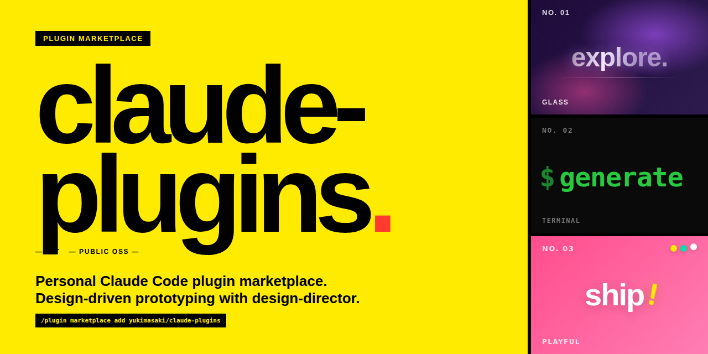

<div align="center">

[English](./README.md) | **日本語**

<video autoplay loop muted playsinline poster="./samples/hero/hero.png" width="100%">
  <source src="./samples/hero/hero.webm" type="video/webm">
  
</video>

> このヒーロー画像は **100% [`design-director`](./plugins/design-director) で生成**されました。[制作プロセス](./samples/hero/README.ja.md)（実セッションのプロンプト全公開）も閲覧できます。

# claude-plugins

**Personal Claude Code plugin marketplace** · デザイン駆動のプロトタイピングを [`design-director`](./plugins/design-director) で。

[](./LICENSE)
[](https://github.com/yukimasaki/claude-plugins/releases)
[](https://github.com/yukimasaki/claude-plugins/stargazers)
[](./CONTRIBUTING.md)
[](https://docs.anthropic.com/en/docs/claude-code)

</div>

<br>

> **Disclaimer**: このリポジトリは Anthropic 社、Claude™、または Claude Design™ と提携・関係していません。
> "Claude" は Anthropic 社の商標です。

<br>

## TL;DR

- **何これ**: Yuki Masaki が個人開発する Claude Code 用プラグインマーケットプレイス（`kit`）
- **第一弾**: `design-director` — 自然言語ブリーフから UI バリエーションを並列生成 → ギャラリーで比較 → React JSX 納品まで対話で進めるデザイン駆動スキル
- **ライセンス**: MIT、商用利用可

<br>

## 目次

- [Quick Start](#quick-start)
- [Features](#features)
- [プラグイン一覧](#プラグイン一覧)
- [対応環境](#対応環境)
- [FAQ](#faq)
- [開発ガイド](#開発ガイド)
- [ライセンスとクレジット](#ライセンスとクレジット)

<br>

## Quick Start

Claude Code 内で以下を順に実行:

```
/plugin marketplace add yukimasaki/claude-plugins
/plugin install design-director@kit
/design-director
```

<br>

## Features

| 機能 | 概要 |
|---|---|
| デザイン駆動 | 自然言語ブリーフ → 美学探索 → 3 案並列生成を対話で進行 |
| ギャラリー駆動 | `serve` でローカルギャラリーを起動し、案を比較・深掘り |
| 自動納品 | React JSX バリエーションと `HANDOFF.md` を自動出力 |
| 拡張前提 | design-director を起点に、今後プラグインを追加予定 |

<br>

## プラグイン一覧

### design-director

> デザイン駆動のプロトタイピング支援スキル。
> 自然言語ブリーフから美学探索 → 3 案生成 → 深掘り → 納品までを対話で進めるエージェントスキル。

| 項目 | 内容 |
|---|---|
| バージョン | `0.1.0` |
| インストール | `/plugin install design-director@kit` |
| 起動 | `/design-director` |
| サブコマンド | `default` / `update` / `serve` / `list` / `export` / `edit` / `memory` / `reset` / `status` |
| 出力 | `.design-studio/projects/{slug}/` に React JSX + HANDOFF.md |
| ギャラリー | `/design-director serve` で `http://localhost:3000` |
| ドキュメント | [README](./plugins/design-director/skills/design-director/README.md) |

<br>

## 対応環境

| 環境 | 対応 | 備考 |
|:-----|:----:|:-----|
| Claude Code CLI | ○ | マーケットプレイスから自動インストール |
| Claude Desktop（Code タブ） | ○ | 同上 |
| VS Code / JetBrains 拡張 | ○ | 同上 |

<br>

## FAQ

**Q. Anthropic 公式のプラグインですか？**
いいえ、個人で開発・公開しているサードパーティ製です。Anthropic 社、Claude™、Claude Design™ とは提携・関係していません。

**Q. なぜ作ったのですか？**
Claude Code でデザイン駆動のプロトタイピングを行う際の自分のワークフローを標準化したかったためです。同じ課題を持つ方の役に立てばと考え、コミュニティへ公開しています。

**Q. 商用利用できますか？**
はい、MIT ライセンスの範囲で自由に利用できます。詳細は [LICENSE](./LICENSE) を参照してください。

**Q. プラグインの追加リクエストや不具合報告は？**
[Issues](https://github.com/yukimasaki/claude-plugins/issues) と Discussions（公開準備中）をご利用ください。

**Q. 既存プラグインへの貢献は歓迎されますか？**
はい。新しいデザイン参照の追加など、PR 歓迎です。詳細は [CONTRIBUTING.md](./CONTRIBUTING.md) を参照してください。

<br>

## 開発ガイド

### ローカルテスト

```bash
claude --plugin-dir ./plugins/design-director
```

### バリデーション

```bash
claude plugin validate .
```

### 新しいデザイン参照を追加したい

`plugins/design-director/skills/design-director/references/design-md/` 配下にファイルを追加する PR を歓迎します。
詳細は [CONTRIBUTING.md](./CONTRIBUTING.md) を参照してください。

<br>

## ライセンスとクレジット

このリポジトリは [MIT License](./LICENSE) で配布されています。

vendored upstream プロジェクトのクレジット・帰属表示は [ATTRIBUTIONS.md](./ATTRIBUTIONS.md) を参照してください。

<br>

---

<div align="center">

Built with [Claude Code](https://docs.anthropic.com/en/docs/claude-code)

</div>
